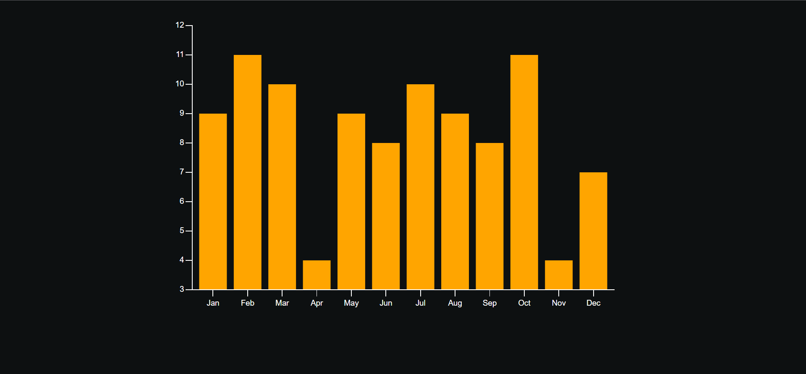

# VISX Chart 📈

## General Info
**TikTik - Video-Sharing Social Media Website. This TikTok Clone Application includes Google Auth, the ability to upload, publish, share, comment on, and like the videos; filtering by categories and advanced search functionalities, profile pages, suggested accounts, custom responsive design, and much more..** 
<a href="https://chart-37.netlify.app" target="_blank" >👉🎯👈</a>
VISX Chart - a JavaScript web application that fetches a relevantly-sized list of posts from a mock GraphQL API and displays a chart representing the number of posts created in each month of 2019.

***

Technologies:
- React JS
- VISX
- GraphQL API
- Apollo

## Available Scripts

In the project directory, you can run:

### `npm start`

Runs the app in the development mode.\
Open [http://localhost:3000](http://localhost:3000) to view it in your browser.
